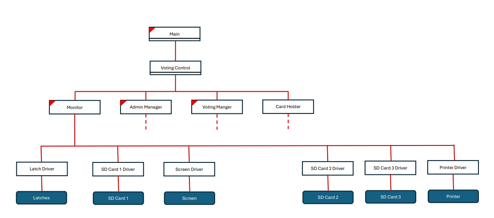

# 🗳️ Voting Machine Simulator

A multi-component **voting machine simulation system** written in **Java**, designed to model real-world voting infrastructure. This project simulates communication between voting hardware components such as card readers, printers, screens, and a central voting manager — all using Java sockets and threading.

---

## 📌 Features

- 🧾 Simulated smart cards with voter info stored on virtual SD cards  
- 🖨️ Printer and screen devices with simulated I/O  
- 🧠 Voting manager logic that processes votes and handles device coordination  
- 🔄 Multi-threaded architecture using Java’s `BlockingQueue` for inter-component messaging  
- 🧪 Terminal-based control panel for inserting cards and triggering events  
- ❌ Failure simulation (e.g., printer failure) to test system resilience  

---

## 🛠️ Technologies Used

- **Language:** Java  
- **Concurrency:** Java Threads, `BlockingQueue`  
- **Communication:** Java Sockets  
- **File I/O:** Serialization of ballot and card objects  
- **IDE:** IntelliJ IDEA  

---

## 🏗️ Architecture

The system follows a modular architecture where each hardware component (screen, printer, SD card readers, etc.) is simulated as a separate thread that communicates with a central controller called `VotingControl`. These components interact using message-passing and socket communication.

### 📊 System Diagram

> ℹ️ Make sure to place the image in your repo (e.g., under a `resources/` folder), and update the path if needed.

### 🧩 Component Overview

- **Main**  
  Launches the system and initializes all components.

- **VotingControl**  
  Acts as the central hub, managing communication and coordination among all subsystems.

- **Monitor**  
  Observes and logs the system's state.

- **AdminManager**  
  Handles admin interactions and system configuration.

- **VotingManager**  
  Validates and processes incoming votes.

- **CardHolder**  
  Interfaces with SD card readers representing voter cards.

---

### 🔌 Drivers and Devices

| Driver            | Connected Component |
|------------------|----------------------|
| Latch Driver      | Latches              |
| SD Card 1 Driver  | SD Card 1            |
| Screen Driver     | Screen               |
| SD Card 2 Driver  | SD Card 2            |
| SD Card 3 Driver  | SD Card 3            |
| Printer Driver    | Printer              |

Each driver operates as an independent thread and communicates with `VotingControl` using top down, mimicking asynchronous hardware communication in a real voting machine environment.

---

## 🚀 How to Run

Follow these steps to run the full voting machine simulation:

### 1. Run the **Client GUI**
Launch the graphical interface that simulates the voting screen. This should be started first to prepare the devices for communication.

### 2. Run the **Terminal Window Server**
This acts as the control center for simulating card insertions, hardware failures, and other interactive inputs. It communicates with the clients via Java sockets.

### 3. Run the **Main File**
Once both the client GUI and the server are running, execute the `Main.java` file. This initializes the system, loads devices, and starts the election workflow.

---

### 🗳️ Starting the Voting Process

Once all components are running, you'll use the terminal to simulate card insertions. To begin:

- **Insert a Voter Card:**  
  Type `V` followed by a **12-digit number** (e.g., `V\n123456789012`) to simulate inserting a valid voter card.

- **Insert an Admin Card:**  
  Type `A` followed by a **12-digit number** (e.g., `A\n000000000001`) to simulate inserting an admin card and accessing administrative options.

The system will respond based on the card type and allow the voter or admin to proceed through the appropriate workflow.

---

### ⚠️ JavaFX Dependency Warning

> **Important:** This project uses **JavaFX**, which is **not bundled** with some JDK distributions (like OpenJDK).  
> You must ensure that JavaFX is properly set up in your development environment.
